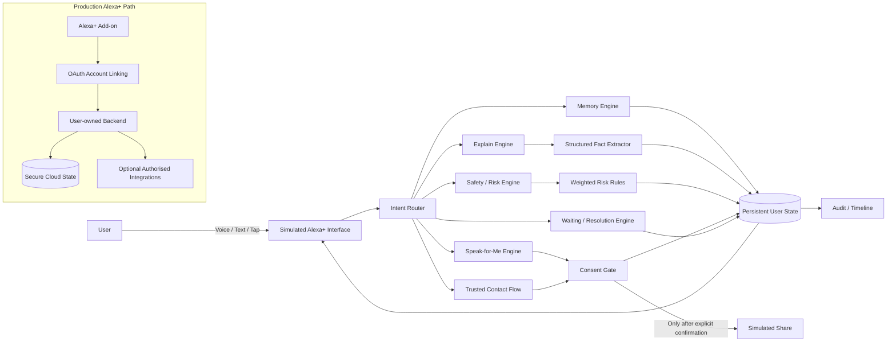

# My Voice — Architecture

## Current prototype
- Runs locally in the browser.
- No paid API dependencies.
- Voice input uses browser speech recognition where supported.
- All workflows also work with text input.
- Persistence uses local browser storage.
- External sending is simulated.

## Production path
A production version could replace the simulated interface with an Alexa+ add-on, use the account-linking method required for its integration path, and move persistent user data into a secure backend. None of that production path is implemented in this prototype. Alexa+ add-on tooling is currently available only to selected partners, and a real release would require certification and on-device testing.

Consent, sharing permissions and safety rules should remain deterministic and auditable even if an LLM is later introduced for language understanding.
